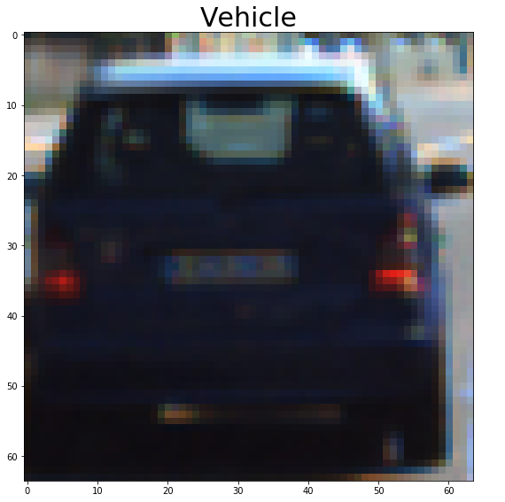

# Vehicle Detection Project

The goals / steps of this project are the following:

* Perform a Histogram of Oriented Gradients (HOG) feature extraction on a labeled training set of images and train a classifier Linear SVM classifier
* Optionally, you can also apply a color transform and append binned color features, as well as histograms of color, to your HOG feature vector.
* Note: for those first two steps don't forget to normalize your features and randomize a selection for training and testing.
* Implement a sliding-window technique and use your trained classifier to search for vehicles in images.
* Run your pipeline on a video stream (start with the test_video.mp4 and later implement on full project_video.mp4) and create a heat map of recurring detections frame by frame to reject outliers and follow detected vehicles.
* Estimate a bounding box for vehicles detected.

## [Rubric](https://review.udacity.com/#!/rubrics/513/view) Points
### Here I will consider the rubric points individually and describe how I addressed each point in my implementation.

---
### Writeup / README

#### 1. Provide a Writeup / README that includes all the rubric points and how you addressed each one.  You can submit your writeup as markdown or pdf.  [Here](https://github.com/udacity/CarND-Vehicle-Detection/blob/master/writeup_template.md) is a template writeup for this project you can use as a guide and a starting point.

You're reading it!

### Histogram of Oriented Gradients (HOG)

#### 1. Explain how (and identify where in your code) you extracted HOG features from the training images.

The code for this step is contained in the "Feature extraction" section of the [IPython notebook](vehicle_detection.ipynb).

I started by reading in all the `vehicle` and `non-vehicle` images.  Here is an example of one of each of the `vehicle` and `non-vehicle` classes:

I then explored different color spaces and different `skimage.hog()` parameters (`orientations`, `pixels_per_cell`, and `cells_per_block`).  I grabbed random images from each of the two classes and displayed them to get a feel for what the `skimage.hog()` output looks like.

Here is an example using the `YCrCb` color space and HOG parameters of `orientations=11`, `pixels_per_cell=(8, 8)` and `cells_per_block=(2, 2)`:

#### 2. Explain how you settled on your final choice of HOG parameters.

I tried different parameter combinations and came up, got best results with :

* orientations: `11`
* pixels_per_cell: `(8, 8)`
* cells_per_block: `(2, 2)`
* hog channels: `ALL`

#### 3. Describe how (and identify where in your code) you trained a classifier using your selected HOG features (and color features if you used them).

Before training, I normalized features in "Normalize features" section of the [IPython notebook](vehicle_detection.ipynb) using sklearn's `StandardScaler`. I stacked vehicle and non-vehicle features and created a corresponding vector with labels. Next, in section "Training" I trained a linear SVC. I used `GridSearchCV` to tune the `C` parameter.

### Sliding Window Search

#### 1. Describe how (and identify where in your code) you implemented a sliding window search.  How did you decide what scales to search and how much to overlap windows?

Sliding window code is located in "Sliding window" section of the IPython notebook. I used 3 scales: 1.0, 1.5 and 2.0. I didn't slide thought the entire frame. Instead, search is limited by height - smaller windows are located close to the horizon, where cars are smaller. I ignored bottom part of the frame (where car's hood is) and top part above the horizon - flying cars are not a thing yet :)

#### 2. Show some examples of test images to demonstrate how your pipeline is working.  What did you do to optimize the performance of your classifier?

Ultimately I searched on 3 scales using YCrCb 3-channel HOG features plus spatially binned color and histograms of color in the feature vector, which provided a nice result. See example images below in the "Video Implementation" section.

---

### Video Implementation

#### 1. Provide a link to your final video output.  Your pipeline should perform reasonably well on the entire project video (somewhat wobbly or unstable bounding boxes are ok as long as you are identifying the vehicles most of the time with minimal false positives.)

Here's a [link to my video result](./output.mp4)

#### 2. Describe how (and identify where in your code) you implemented some kind of filter for false positives and some method for combining overlapping bounding boxes.

All magic happens inside `make_pipeline()` function, which is located in "pipeline section" of the IPython notebook. I recorded the positions of positive detections in each frame of the video.  From the positive detections I created a heatmap. I also added heatmaps from previous 25 frames (roughly 1 second of footage). Then I apply a threshold. I used `scipy.ndimage.measurements.label()` to identify individual blobs in the heatmap.  I then assumed each blob corresponded to a vehicle.  I constructed bounding boxes to cover the area of each blob detected.

Here's an example result showing the heatmap (note: these are not series of frames, just individual heatmaps, no previous frame heatmaps are applied):

---

### Discussion

#### 1. Briefly discuss any problems / issues you faced in your implementation of this project.  Where will your pipeline likely fail?  What could you do to make it more robust?

I've noticed that when two cars are close to each other, the pipeline detects them as one entry because their heatmaps overlaps. Not sure how to solve it using current approach.

One way to improve the pipeline is to switch it to use a regional deep learning neural network (like YOLO or SSD). I actually tried to run an [SSD300 model, pre-trained
 on VOL2007 dataset](https://github.com/rykov8/ssd_keras) on the project video - it worked quite well out of the box! Additional training on Udacity datasets could make the results even better. I'll try using this method next time.

 
